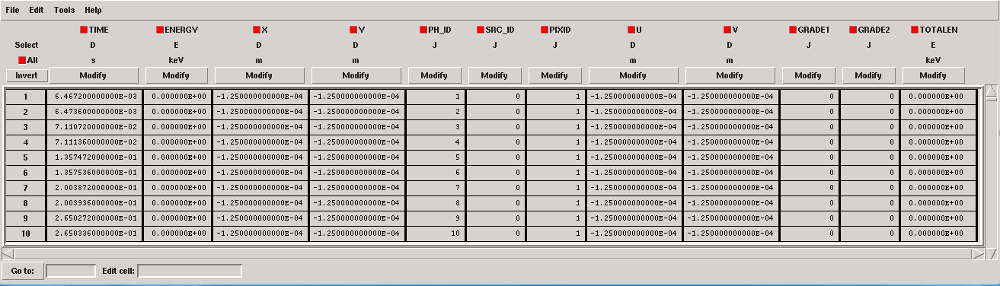
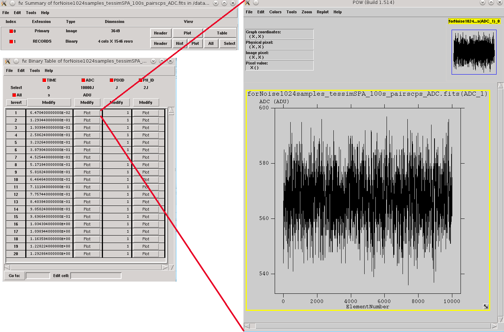
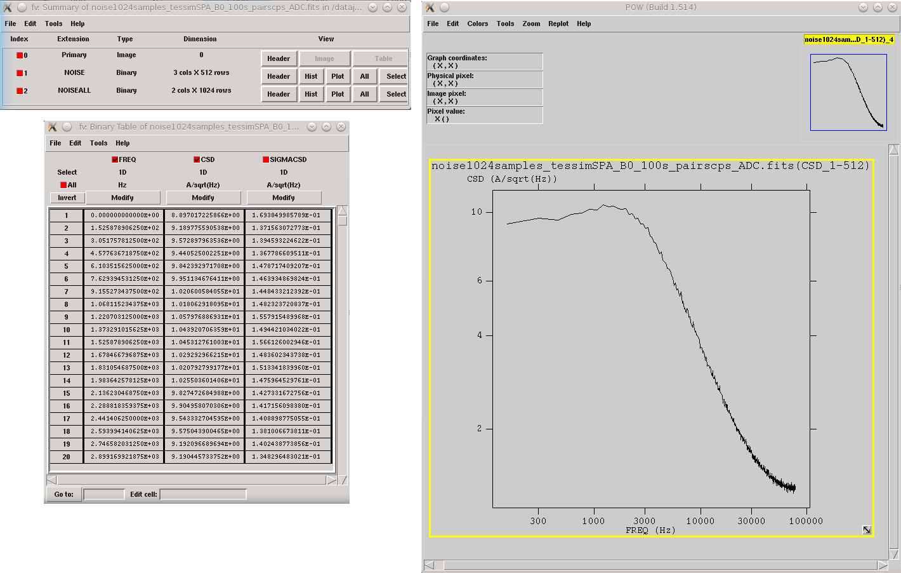
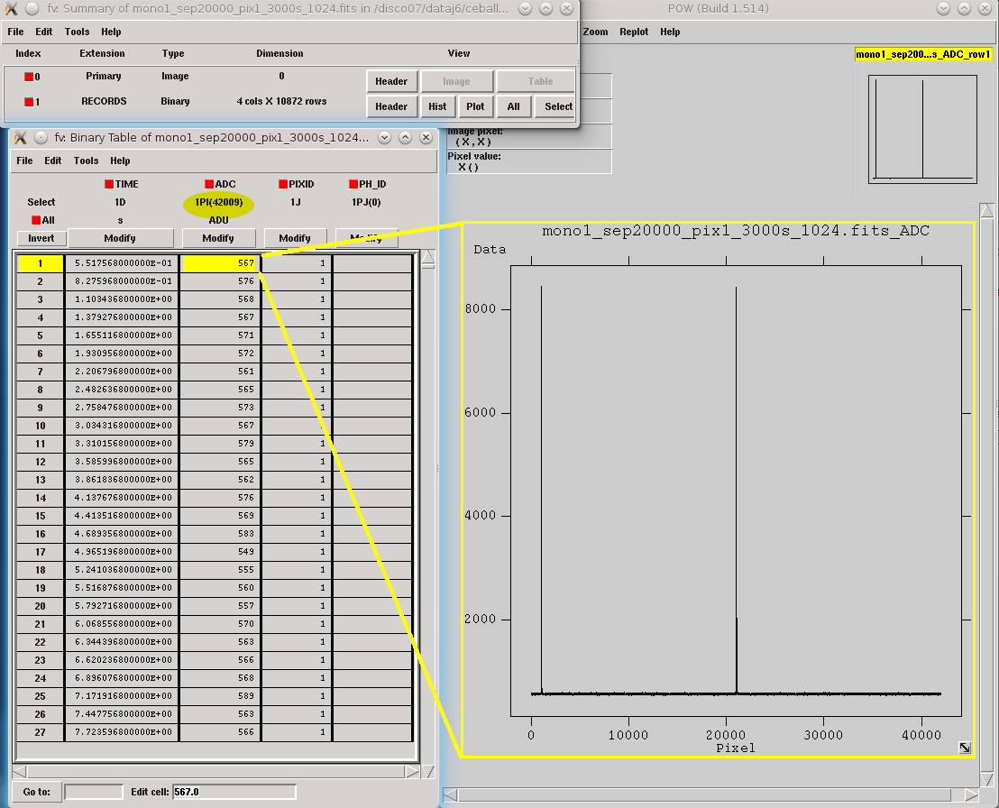
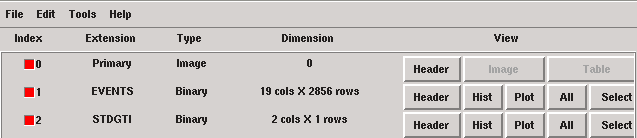
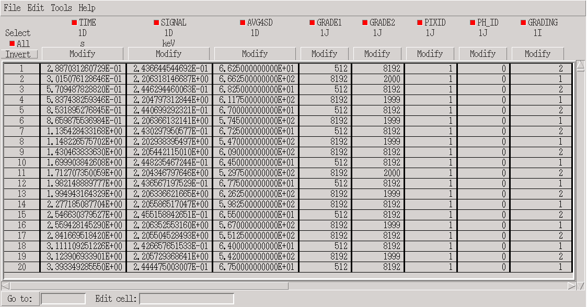

.. _SIRENA:

.. role:: pageblue
.. role:: red

####################
SIRENA description
####################

********
Purpose
********

SIRENA (*Software Ifca for Reconstruction of EveNts for Athena X-IFU*) is a software package developed to reconstruct the energy of the incoming X-ray photons after their detection in the `X-IFU <http://x-ifu.irap.omp.eu/>`_ TES detector. It is integrated in the `SIXTE <http://www.sternwarte.uni-erlangen.de/research/sixte>`_ end-to-end simulations environment where it currently runs over SIXTE simulated data. This is done by means of a tool called :ref:`tesreconstruction`, which is mainly a wrapper to pass a data file to the SIRENA tasks.

******
Files
******

.. _auxiliary:

Auxiliary Files
===============

All the :ref:`reconstruction methods <reconMethods>` used by SIRENA software rely on the existence of a *library* created from a set of data calibration files. In addition, some methods require also a file with the *noise data*. Let's describe these auxiliary files in detail.

.. _noise:

:pageblue:`Noise file`
------------------------

The detector **noise file** is currently obtained from a long stream of pulse-free (noise) simulated data. This stream is ingested in the tool :ref:`gennoisespec`, which generates the spectrum of this simulated noise.

**1) Calibration Stream Simulation**

The simulation of the noise stream is performed by these SIXTE tools:

  * ``tesconstpileup``:  which creates a :ref:`piximpact file <pixImpactFig>` of zero-energy events. 
  * ``tessim`` (:cite:`Wilms2016`): which simulates these fake impacts through the detector's physics and creates data stream splitted into records (use option `triggertype=noise`).
  
  
The sequence of commands that must be run is as follows:

::

    > tesconstpileup PixImpList=noise.piximpact XMLFile=tes.XML tstop=simulationTime energy=0 \
    pulseDistance=1 triggersize=10000
    
    
.. _pixImpactFig:

.. figure:: images/NoisePiximpact1.png
   :align: center
   :width: 50%  

   
   Piximpact file of no events.

::
  
    > tessim PixID=pixelNumber PixImpList=noise.piximpact Streamfile=noise.fits tstart=0. \
    tstop=simulationTime triggertype=noise triggersize=10000 prebuffer=1000 \
    PixType=newpixels[SPA] acbias=yes

.. _noise-records:
      

   
   Noise file triggered into records of 10000 samples.
   
   
**2) Noise spectrum and weight matrices generation**

In :ref:`gennoisespec`, the data is analysed record by record: if there are events present, this tool :ref:`finds <detect>` and rejects them, keeping only the pulse-free intervals of a size given by the input parameter :option:`--intervalMinSamples`. If no events are present, the record is divided into pulse-free intervals sized also by this parameter.

Once the pulse-free intervals have been defined, a long noise interval is built by putting together these pulse-free intervals in order to calculate the noise baseline. Then, the baseline is subtracted from each pulse-free interval.

On one hand, the tool calculates the FFT of the pulse-free intervals (over the unfiltered data) and averages them. Only a specific number of intervals (input parameter :option:`--nintervals`) will be used. The noise spectrum density is stored in the HDUs *NOISE* and *NOISEALL* in the *noise data* file.

::
    
    > gennoisespec --inFile=noise.fits --outFile=noiseSpec.fits --intervalMinSamples=pulseLength \
    --nintervals=1000 --pulse_length=pulseLength 
                
.. _noiseSpec:

   
   Noise spectrum (see noise file :ref:`description <outNoise>`)

On the other hand, the tool calculates the covariance matrix of the noise, :math:`V`, whose elements are expectation values (:math:`E[·]`) of two-point products for a pulse-free data sequence :math:`{di}` (over the unfiltered data) (:cite:`Fowler2015`)

.. math::

	V_{ij}=E[d_i d_j]-E[d_i]E[d_j]
	
The weight matrix is the inverse of the covariance matrix, :math:`V^{-1}`. The weight matrixes, **Wx**, for different lenghts are stored in the HDU *WEIGHTMS* in the *noise data* file. The lengths x will be base-2 values and will vary from the base-2 system value closest-lower than or equal-to the :option:`--intervalMinSamples` decreasing until 2.

.. _noiseSpec:

.. figure:: images/WeightMatrix.png
   :align: center
   :scale: 80%
   
   Noise weight matrix (see noise file :ref:`description <outNoise>`)

:ref:`gennoisespec` also adds the ``BASELINE`` and ``NOISESTD`` keywords to the HDU *NOISE* in the *noise data* file. They store the mean and the standard deviation of the noise (by working with the long noise interval).

If the noise spectrum or the weight matrixes are to be created from a data stream containing pulses, care should be taken with the parameters :option:`--scaleFactor`, :option:`--samplesUp` and :option:`--nSgms` responsible of the detection process.

      
.. _library:

:pageblue:`Template Library`
------------------------------

The **library** purpose is to store detector pulse magnitudes (templates, covariance matrices, optimal filters) at different calibration energies, so that they could be used afterwards for the 
reconstruction of input pulses of unknown energy.

To build this library, a bunch of monochromatic pulses at different energies are simulated by ``tesconstpileup`` (which now creates a *piximpact* file with pairs of constant separation pulses) and ``tessim`` (which simulates the detector physics). 

**1) Calibration Files simulation**

Typical run commands to create these calibration files for a given energy *monoEkeV* and a 
given (large) *separation* in samples between the pulses would be:

::

  > tesconstpileup PixImpList=calib.piximpact XMLFile=tes.XML tstop=simulationTime \
  energy=monoEkeV pulseDistance=separation TriggerSize=tsize

  
where *tsize* is the size of every simulation stream containing the two separated pulses.

::

  > tessim PixID=pixelNumber PixImpList=calib.piximpact Streamfile=calib.fits tstart=0. \
  tstop=simulationTime triggertype='diff:3:100:supress' triggerSize=recordSize \
  PixType=newpixels[SPA] acbias=yes
    
where *suppress* is the time (in samples) after the triggering of an event, during which `tessim` will avoid triggering again (see figure below).

.. figure:: images/triggering.png
    :align: center
    :scale: 50%

    Parameters involved in triggering into records from ``tesconstpileup`` to ``tessim``
  
These simulated calibration files are now FITS files with only one HDU called **RECORDS** populated with four columns: **TIME** (arrival time of the event), **ADC** (digitized current), **PIXID** (pixel identification) and **PH_ID** (photon identification, for debugging purposes only).

   Records in calibration file
   
**2) Library construction**

Once the calibration files (for all the 1..N calibration energies) have been created, the library is built through the wrapper tool ``tesreconstruction``. To run it using SIRENA code:

::

  > tesreconstruction Recordfile=calib.fits TesEventFile=evtcal.fits Rcmethod=SIRENA \
  PulseLength=pulseLength LibraryFile=library.fits mode=0 clobber=yes monoenergy=monoEeV_1 \
  EventListSize=1000 NoiseFile=noiseSpec.fits scaleFactor=sF samplesUp=sU nSgms=nS \
  largeFilter=maxlengthfixedfilter
                
  [.....]
  
  > tesreconstruction Recordfile=calib.fits TesEventFile=evtcal.fits Rcmethod=SIRENA \
  PulseLength=pulseLength LibraryFile=library.fits mode=0 clobber=yes monoenergy=monoEeV_N \
  EventListSize=1000 NoiseFile=noiseSpec.fits scaleFactor=sF samplesUp=sU nSgms=nS \
  largeFilter=maxlengthfixedfilter

The relevant parameters of ``tesreconstruction``  for the library creation process are:

* :option:`mode`: should be set to **0** if tool is used for library creation
* :option:`PulseLength`:  length of the pulses to create the pulse templates. If the pulse length used to create the noise is larger that this value, noise will be decimated accordingly when used to pre-calculate the optimal filters or the covariance matrices. If it is shorter, an error will be raised.
* :option:`largeFilter`:  length of the longest fixed filter 
* :option:`monoenergy`: the monochromatic energy of the calibration pulses used to create the current row in the library
* :option:`scaleFactor`, :option:`samplesUp` and :option:`nSgms`: parameters involved in the pulse detection process.

.. _libraryColumns:

**3) Library structure**

The library FITS file has 5 HDUs called **LIBRARY**, **FIXFILTT**, **FIXFILTF**, **PRECALWN** and **PRCLOFWM**.

**LIBRARY** contains the following columns:

* **ENERGY**: energies (in eV) in the library 
* **PULSEHEIGHT**: pulse heights of the templates
* **PLSMXLFF**: long templates according to :option:`largeFilter` (obtained averaging many signals) with baseline. If :option:`largeFilter` is equal to :option:`PulseLength` it does not appear
* **PULSE**: templates (obtained averaging many signals) with baseline
* **PULSEB0**: baseline subtracted templates
* **MF**: matched filters (energy normalized templates)
* **MFB0**: baseline subtracted matched filters
* **COVARM**: :ref:`covariance matrices<covMatrices>` ( :option:`PulseLength` x :option:`PulseLength` in shape )  stored in the FITS column as vectors of size :option:`PulseLength` * :option:`PulseLength`
* **WEIGHTM**: :ref:`weight matrices<covMatrices>` ( :option:`PulseLength` x :option:`PulseLength` in shape) stored in the FITS column as vectors of size :option:`PulseLength` * :option:`PulseLength`
* **WAB**: matrices :math:`(W_\alpha + W_\beta)/2` stored as vectors ( :option:`PulseLength` * :option:`PulseLength` ), being :math:`\mathit{W}` weight matrixes and :math:`\alpha` and :math:`\beta` two consecutive energies in the library
* **TV**: vectors :math:`S_{\beta}-S_{\alpha}` being :math:`S_i` the template at :math:`\mathit{i}` energy
* **tE**: scalars :math:`T \cdot W_{\alpha} \cdot T`
* **XM**: matrices :math:`(W_\beta + W_\alpha)/t` stored as vectors ( :option:`PulseLength` * :option:`PulseLength` )
* **YV**: vectors :math:`(W_\alpha \cdot T)/t`
* **ZV**: vectors :math:`\mathit{X \cdot T}`
* **rE**: scalars :math:`\mathit{1/(Z \cdot T)}`
* **PAB**: vectors :math:`S_{\alpha}- E_{\alpha}(S_{\beta}-S_{\alpha})/(E_{\beta}-E_{\alpha})`, :math:`P(t)_{\alpha\beta}` in :ref:`first order approach <optimalFilter_NSD>` 
* **PABMXLFF**: **PAB** according to :option:`largeFilter`. If :option:`largeFilter` is equal to :option:`PulseLength` it does not appear
* **DAB**: vectors :math:`(S_{\beta}-S_{\alpha})/(E_{\beta}-E_{\alpha})`, :math:`D(t)_{\alpha\beta}` in :ref:`first order approach <optimalFilter_NSD>`

The **FIXFILTT** HDU contains pre-calculated optimal filters in the time domain for different lengths, calculated from the matched filters (*MF* or *MFB0* columns) in **Tx** columns, or from the *DAB* column, in the **ABTx** columns. The lengths *x* will be base-2 values and will vary from the base-2 system value closest-lower than or equal-to the pulse length decreasing until 2. Moreover, **Txmax** and **ABTxmax** columns being *xmax* = :option:`largeFilter` are added.

The **FIXFILTF** HDU contains pre-calculated optimal filters in frequency domain for different lengths calculated from the matched filters (*MF* or *MFB0* columns), in columns **Fx**, or from the *DAB* column, in **ABFx** columns. The lengths *x* will be base-2 values and will vary from the base-2 system value closest-lower than or equal-to the pulse length decreasing until 2. Moreover, **Fxmax** and **ABFxmax** columns being *xmax* = :option:`largeFilter` are added.

The **PRECALWN** HDU contains :ref:`pre-calculated values by using the noise weight matrix from the subtraction of model from pulses <WEIGHTN>` :math:`(R'WR)^{-1}R'W` for different lengths, **PRCLx**. The lengths *x* will be base-2 values and will vary from the base-2 system value closest-lower than or equal-to the pulse length decreasing until 2.

The **PRCLOFWM** HDU contains :ref:`pre-calculated values by using the noise weight matrix from noise intervals <WEIGHTM>` :math:`(X'WX)^{-1}X'W` for different lengths, **OFWx**. The lengths *x* will be base-2 values and will vary from the base-2 system value closest-lower than or equal-to the  decreasing :option:`largeFilter` until 2.

.. _inputFiles:

Input Files
============

The input data (simulated) files, currently required to be in FITS format, are a sequence of variable length ``RECORDS``, containing at least a column for the **TIME** of the digitalization process and a column for the detector current (**ADC**) at these samples. Every record (file row) is the result of an initial triggering process done by the SIXTE simulation tool ``tessim``. 

.. _records:

   
   Simulated data (pulses) in FITS records.

.. _reconOutFiles:
	
Output Files
==============
	
The reconstructed energies for all the detected events are saved into an output FITS file (governed by the ``tesreconstruction`` input parameter :option:`TesEventFile`). It stores one event per row with the following information, in the HDU named **EVENTS**:

* **TIME**: arrival time of the event (in s).

* **SIGNAL**: energy of the event in keV

* **GRADE1**: length of the filter used, i.e., the distance to the following pulse (in samples) or the pulse length if the next event if further than this value or if there are no more events in the same record.

* **GRADE2**: distance to the end of the preceding pulse (in samples). If pulse is the first event in the record, this is fixed to the :option:`PulseLength` value.

* **PIX_ID**: pixel number

* **PH_ID**: photon number identification for cross matching with the impact list (currently not in use).

.. _evtFile:

   Output event file. 

.. _recons:

************************
Reconstruction Process
************************

The energy reconstruction of the energies of the input pulses is performed with the tool ``tesreconstruction`` along three main blocks:

* Event Detection
* Event Grading
* Energy Determination

.. _detect:

Event Detection
================

The first stage of SIRENA processing is a fine detection process performed over every *RECORD* in the input file, to look for missing (or secondary) pulses that can be on top of the primary (initially triggered) ones. The algorithm used for this purpose is the *Adjusted derivative* (see :cite:`Boyce1999`) and it follows these steps:

1.- The record is differentiated and a *median kappa-clipping* process is applied to the data, so that the data values larger than the median plus *kappa* times the quiescent-signal standard deviation, are replaced by the median value in an iterative process until no more data points are left. Then the threshold is established at the clipped-data mean value plus :option:`nSgms` times the standard deviation.

2.- A pulse is detected whenever the signal of :option:`samplesUp` samples is above this threshold .

3.- After the detection, the first sample of the derivative that crosses the threshold is taken as the Start Time of the detected pulse.

4.- Once a primary pulse is detected in the record, the system starts a secondary detection to look for missing pulses that could be hidden by the primary one. For this purpose, a model template is chosen from the auxiliary library (selection based on the first sample of the derivative) and subtracted at the position of the detected pulse. This is an iterative process, until no more pulses are found.

.. _lpf:

If the noise is large, input data can be low-pass filtered for the initial stage of the event detection. For this purpose, the input parameter :option:`scaleFactor` (:math:`\mathit{sF}`) is used. The low-pass filtering is applied as a box-car function, a temporal average window. If the cut-off frequency of the filter is :math:`fc`, the box-car length is :math:`(1/fc) \times \mathit{samprate}`, where :math:`\mathit{samprate}` is the value of the sampling rate in Hz (inverse of the input file keyword ``DELTAT``).

.. math:: 
    
        f_{c1} &= \frac{1}{2\pi\cdot\mathit{sF_1}} \\
        f_{c2} &= \frac{1}{2\pi\cdot\mathit{sF_2}} 
    
for :math:`\mathit{sF_1} < \mathit{sF_2}`
    
.. figure:: images/lowpassfilter.png
        :align: center
        :scale: 50%
        
        Low-pass filtering (LPF)
        
If the parameter :option:`scaleFactor` is too large, the low-pass filter band is too narrow, and not only noise is rejected during the filtering, but also the signal.

.. note:: A proper cut-off frequency of the low-pass filter must be chosen in order to avoid piling-up the first derivative and to detect as many pulses as possible in the input FITS file. However, filtering gives rise to a spreading in the signal so, the pulses start time calculated from the first derivative of the low-pass filtered event (which is spread by the low-pass filtering) has to be transformed into the start time of the non-filtered pulse. 

.. figure:: images/detect.jpeg
   :align: center
   :scale: 80%

   First derivative of initial signal and initial threshold (left) and derivative of signal after subtraction of primary pulses (right).

For testing and debugging purposes, SIRENA code can be run in **perfect detection** mode, leaving out the detection stage, provided the (pairs or triplets of) simulated pulses are at the same position in all the RECORDS. In this case the start sample of the first/second/third pulse in the record is taken from the input parameter(s) :option:`tstartPulse1`, :option:`tstartPulse2`, :option:`tstartPulse3` (parameters :option:`scaleFactor`, :option:`samplesUp` or :option:`nSgms` would then not be required). Currently no subsample pulse rising has been implemented in the simulations nor in the reconstruction code (future development).

.. _grade:

Event Grading
==============

The *Event Grading* stage qualifies the pulses according to the proximity of other events in the same record. 

Once the events in a given record have been detected and their start times established, **grades** are assigned to every event taking into account the proximity of the following and previous pulses. This way, pulses are classified as *High*, *Medium* or *Low* resolution. Currently the grading is performed following the information in the input :option:`XMLFile`.

.. _reconMethods:

Event Energy Determination: methods
====================================

Once the input events have been detected and graded, their energy content can be determined. Currently all the events (independently of their grade) are processed with the same reconstruction method, but in the future, a different approach could be taken, for example simplifying the reconstruction for the lowest resolution events.

The SIRENA input parameter that controls the reconstruction method applied is :option:`EnergyMethod` that should take values of *OPTFILT* for Optimal Filtering in Current space, *WEIGHT* for Covariance Matrices, *WEIGHTN* for first order approach of Covariance matrices method and *I2R*, *I2RALL*, *I2RNOL* or *I2RFITTED* for Optimal Filtering implementation in (quasi)Resistance space. If optimal filtering and :option:`OFNoise` is *WEIGHTM* tthe noise weightt matrix from noise intervals is employed instead the noise spectral density (:option:`OFNoise` is *NSD*).

.. _optimalFilter_NSD:

:pageblue:`Optimal Filtering by using the noise spectral density`
------------------------------

	This is the baseline standard technique commonly used to process microcalorimeter data streams. It relies on two main assumptions. Firstly, the detector response is linear; that is, the pulse shapes are identical regardless of their energy and thus, the pulse amplitude is the scaling factor from one pulse to another :cite:`Boyce1999`, :cite:`Szym1993`. 

     	In the frequency domain (as noise can be frequency dependent), the raw data can be expressed as :math:`P(f) = E\cdot S(f) + N(f)`, where :math:`S(f)` is the normalized model pulse shape (matched filter), :math:`N(f)` is the noise and :math:`E` is the scalar amplitude for the photon energy.
     	
     	.. S(f) is template with Baseline (removed in F0 strategy)

     	The second assumption is that the noise is stationary, i.e. it does not vary with time. The amplitude of each pulse can then be estimated by minimizing (weighted least-squares sense) the difference between the noisy data and the model pulse shape, being the :math:`\chi^2` condition to be minimized: 
     	
     	.. _eqOPT:
     	
     	.. math::

        	 \chi^2 = \int \frac{(P(f)-E \cdot S(f))^2}{\langle\lvert N(f)\lvert ^2\rangle} df

     	In the time domain, the amplitude is the best weighted (optimally filtered) sum of the values in the pulse. 

     	.. math::

        	E = k \int P(t)\cdot OF(t), 

     	where :math:`OF(t)` is the time domain expression of optimal filter in frequency domain 

        .. math::

		OF(f) = \frac{S^*(f)}{\langle\lvert N(f)\lvert ^2\rangle}

	and :math:`k` is the normalization factor to give :math:`E` in units of energy

	.. math:: 

		k = \int \frac{S(f)\cdot S^{*}(f)}{\langle\lvert N(f)\lvert ^2\rangle} df

     	Optimal filtering reconstruction can be currently performed in two different implementations: *baseline subtraction* (B0 in SIRENA wording), where the baseline value read from the ``BASELINE`` keyword in the noise file is subtracted from the signal, and *frequency bin 0* (F0), where the frequency bin at *f=0 Hz* is discarded for the construction of the optimal filter. The final filter is thus zero summed, which produces an effective rejection of the signal baseline (see :cite:`Doriese2009` for a discussion about the effect of this approach on the TES energy resolution). This option is controlled by the parameter :option:`FilterMethod`.

     	**As the X-IFU detector is a non-linear one, the energy estimation after any filtering method has been applied, has to be transformed to an unbiased estimation by the application of a gain scale obtained by the application of the same method to pulse templates at different energies (not done inside SIRENA)**.
     	
	In SIRENA, optimal filters can be calculated *on-the-fly* or read as pre-calculated values from the calibration library. This option is selected with the input parameter :option:`OFLib`. If :option:`OFLib` =1, fixed-length pre-calculated optimal filters (**Tx** or **Fx**) will be read from the library (the length selected **x** will be the base-2 system value closest -lower than or equal- to that of the event being reconstructed or :option:`largeFilter`). If :option:`OFLib` =0, optimal filters will be calculated specifically for the pulse length of the event under study. This length calculation is determined by the parameter :option:`OFStrategy`. This way :option:`OFStrategy` = *FREE* will optimize the length of the filter to the maximum length available (let's call this value *fltmaxlength*), given by the position of the following pulse, or the pulse length if this is shorter. If :option:`OFStrategy` = *BASE2* the filter length will be the base-2 system value closest-lower than or equal-to *fltmaxlength*. :option:`OFStrategy` = *BYGRADE* will choose the filter length to use, according to the :ref:`grade <grade>` of the pulse (currently read from the :option:`XMLFile`) and :option:`OFStrategy` = *FIXED* will take a fixed length (given by the parameter :option:`OFLength`) for all the pulses. These last 3 options are only for checking and development purposes; a normal run with *on-the-fly* calculations with be done with :option:`OFStrategy` = *FREE*. Note that if :option:`OFLib` =0, a noise file must be provided through parameter :option:`NoiseFile` (not in the case of :option:`OFLib` =1), since in this case the optimal filter must be computed for each pulse at the required length.

        .. 
            OFLib=0 (On-the-fly): Matched Filter MF(t) with the closest (>=) length to the pulse length, is read from the library ==> cut to the required length ==> NORMFACTOR is calculated from trimmed MF and the decimated noise ==> short OF is calculated ==> energy :  NOISE file required
            OFLib=1 : OF(t) with the closest (>=) length to the pulse length (NORMFACTOR included) is read from the library ==> energy : NOISE file not required

            OPTIMAL filters saved in the library already contain the NORMFACTOR
            
	
	In order to reconstruct all the events using filters at a single monochromatic energy, the input library should only contain one row with the calibration columns for that specific energy. If the input library is made of several monochromatic calibration energies, the optimal filters used in the reconstruction process can be tunned to the initially estimated energy of the event being analysed. For this purpose, a first order expansion of the temporal expression of a pulse at the unknown energy *E* will be taken into account:
	
	.. _0n:

	.. math::

		P(t,E) = S(t,E_{\alpha}) + b + \frac{(E-E_{\alpha})}{(E_{\beta}-E_{\alpha})}[S(t,E_{\beta})- S(t,E_{\alpha})]
		
	..      Therefore, the data are on the top of a baseline and the pulse templates have a null baseline. 
	
	where :math:`b` is the baseline level, and :math:`S(t,E_{\alpha}), S(t,E_{\beta})` are pulse templates (**PULSEBO** columns) at the corresponding energies :math:`E_{\alpha}, E_{\beta}` which embrace the energy :math:`E`. Operating here and grouping some terms:

	.. math::

		& P(t)_{\alpha\beta} = S(t,E_{\alpha}) - \frac{E_{\alpha}}{(E_{\beta}-E_{\alpha})}[S(t,E_{\beta})-S(t,E_{\alpha})]\\
		& D(t)_{\alpha\beta} = \frac{[S(t,E_{\beta})-S(t,E_{\alpha})]}{(E_{\beta}-E_{\alpha})}

	then

	.. math::
		P(t,E) - P(t)_{\alpha\beta} = E \cdot D(t)_{\alpha\beta} + b
	
	This expression resembles the one above for the optimal filtering if now the data :math:`P(t)` is given by :math:`P(t,E) - P(t)_{\alpha\beta}` and the role of normalized template :math:`S(f)` is played by :math:`D(t)_{\alpha\beta}`. This way, the optimal filters can be built over :math:`D(t)_{\alpha\beta}`. 
	
	Again, :option:`OFLib` will control whether the required (*interpolated*) optimal filter (built from :math:`D(t)_{\alpha\beta}`) is read from the library (at any of the several fixed lengths stored, **ABFx** or **ABTx**) or whether an adequate filter is calculated *on-the-fly* (:option:`OFLib` = *0*).
	
        .. figure:: images/OPTloop.png
            :align: center
            :scale: 80%
		
            Decision loop for optimal filter calculation
            
	The optimal filtering technique (selected through the input parameter :option:`EnergyMethod`) can be applied in the frequency or in the time domain with the option :option:`FilterDomain`.
	
	The misalignement between the triggered pulse and the template applied for the optimal filter can affect the energy estimate. As the response will be maximum when the data and the template are coincident, an option has been implemented in SIRENA to calculate the energy at five different fixed lags between both, and estimate the final energy to better than the sample frequency (:cite:`Adams2009`). This possibility is driven by input :option:`LagsOrNot`.

.. _optimalFilter_WEIGHTM:

:pageblue:`Optimal Filtering by using the noise weight matrix from noise intervals`
------------------------------

	By choosing the input parameter :option:`OFNoise` as **WEIGHTM** the optimal filtering method is going to use the noise weight matrix calculated from noise intervals (rather than the noise spectral density as in :ref:`first order approach <optimalFilter_NSD>`). Using the noise power spectrum (FFT) is also possible, but it introduces an additional wrong assumption of periodicity. The signal-to-noise cost for filtering in the Fourier domain may be small in some cases but it is worth while checking the importance of this cost (:cite:`Fowler2015`).

	Being :math:`W` the noise covariance matrix, the best estimate energy is (:ref:`see mathematical development <WEIGHTN>`):
	
	.. math::
			
		E = e_1^T[X^T \cdot W \cdot X]^{-1} [X^T \cdot W \cdot Y]
		
where :math:`e_1^T \equiv [1, 0]` is the unit vector to select only the term that corresponds to the energy (amplitude) of the pulse. :math:`M` is a model matrix whose first column is the pulse shape and the second column is a column of ones in order to can calculate the baseline. :math:`Y` is the measured data.

.. _rSpace:

:pageblue:`Quasi Resistance Space`
----------------------------------

	A new approach aimed at dealing with the non-linearity of the signals, is the transformation of the current signal before the reconstruction process to a (quasi) resistance space (:cite:`Bandler2006`, :cite:`Lee2015`). It should improve the linearity by removing the non-linearity due to the bias circuit, although the non-linearity from the R-T transition still remains. A potential additional benefit could also be a more uniform noise across the pulse. 

	This type of transformations are currently implemented in SIRENA and can be accessed through the :option:`EnergyMethod` command line option. Some of them, considers linearization as a linear scale in the height of the pulses with energy (*I2RALL*, *I2RNOL*, *I2R*) while the last one is also able to get a linear  gain scale when the signal is reconstructed with a simple filter (*I2RFITTED*).
	
	Let's see first some definitions given by columns and keywords in ``tessim`` simulated data files.

	:PXLnnnnn: column that stores the data signal in pixel *nnnnn* [ADC]
	:PULSEnnnnn: column for the data signal in pixel *nnnnn* over the bias current [Amp]
	:``ADUCNV``: ADU conversion factor [Amp/ADU]
	:``I0_START``: Initial bias current [Amp]
	:``IMIN``: Current corresponding to 0 ADU [Amp]
	:I: Data signal in Current space [Amp]
	:``R0``: Operating point resistance [Ohm]
	:``TTR``: Transformer Turns Ratio
	:``LFILTER``: Filter circuit inductance [H]
	:``RPARA``: Parasitic resistor value [Ohm]

	:math:`IP \equiv \mathit{PULSEnnnnn} = \mathit{PXLnnnnn} \times` ``ADUCNV`` + ``IMIN`` = ``I0_START`` - I

	* **I2RALL** transformation

                ``tessim`` (:cite:`Wilms2016`) is based on a generic model of the TES/absorber pixel with a first stage read-out circuit. The overall setup of this model is presented in the figure below. ``tessim`` performs the numerical solution of the differential equations for the time-dependent temperature, :math:`T(t)`, and the current, :math:`I(t)`, in the TES using :cite:`Irwin2005` :
                
                .. figure:: images/Physicsmodel_equivalentcircuit.png
                   :align: center
                   :width: 60% 
                                        
                   Physics model coupling the thermal and electrical behaviour of the TES/absorber pixel used by ``tessim``.
                         
                         
                .. math::

			C \frac{dT}{dt} = -P_b + R(T,I)I^2 + P_{X-ray} + Noise

			L \frac{dI}{dt} = V_0 - IR_L - IR(T,I) + Noise
						
                In the electrical equation, :math:`L` is the effective inductance of the readout circuit, :math:`R_L` is the effective load resistor and :math:`V_0` is the constant voltage bias. Under AC bias conditions, 
                
                :math:`L =` ``LFILTER`` / ``TTR²``
			
                :math:`R_L =` ``RPARA`` / ``TTR²``
                
                :math:`\mathit{V0} =` ``I0_START`` ( ``R0`` :math:`+ \mathit{R_L} )`
                
                and thus the transformation to resistance space is:

                :math:`R = (\mathit{V0} - I \cdot R_L - L \cdot dI/dt)/I`

        * **I2RNOL** transformation

		In the previous transformation *I2RALL*, the addition of a derivative term increases the noise and thus degrades the resolution. Therefore, a new transformation *I2RNOL* is done where the circuit inductance is neglected ( :cite:`Lee2015` ), thus suppressing the main source on non-linearity of the detector that comes from the first stage read-out circuit:
		
		.. math::

			R = (\mathit{V0} - I \cdot R_L)/I
	
	* **I2R** transformation

		A different linearization (in the sense of pulse height vs. energy) has been implemented in SIRENA for developing purposes:
		
		.. math::

			R = \mathit{R0} - \mathit{R0}\left(\frac{abs(\mathit{IP}-\mathit{I0\_START})/\mathit{I0\_START}}{1 + abs(\mathit{IP}-\mathit{I0\_START})/\mathit{I0\_START}}\right)
			
        * **I2RFITTED** transformation

                Looking for a simple transformation that would produce also a linear gain scale, a new transformation *I2RFITTED* has been proposed in :cite:`Peille2016`: 
		
		.. math::

			R = \mathit{V0}/(I_{fit}+I)
                                        
		*The optimal* :math:`I_{fit}` was found to be  :math:`45.3\mu A`.*

.. _covMatrices:
		
:pageblue:`Covariance matrices`
---------------------------------
        .. Unknown Pulses U -> remove baseline using keyword in noise file
           Models M: without baseline

	In real detectors, none of the above assumptions (linearity and stationary noise) is strictly correct, so a different approach is required in the presence of non-stationary noise along the signal event, which has to be optimal also when the detector is non-linear. In this method a set of calibration points constructed by many pulse repetitions (:math:`S^i`), is defined at different energies :math:`(\alpha, \beta, ...)`. At these energy points, a pulse model (**PULSEB0** column in library) is obtained averaging the data pulses :math:`(M = <S^i>)`, and the deviations of these pulses from the data model :math:`(D^i = S^i - M^i)` are used to build a covariance matrix :math:`V^{ij} = <D^iD^j>` (the weight matrix :math:`W`, inverse of the covariance matrix, is also calculated).  The non-stationary noise is better described by a full noise covariance matrix rather than a simpler Fourier transform :cite:`Fixsen2004`.

   	An initial estimation of the energy of the unknown signal data is sufficient to determine the calibration points which straddle it. Then with a linear interpolation of the weight matrix and the signal, the best energy estimate is just a function of the energies of the embracing calibration points, the unknown signal and some other magnitudes that can be pre-calculated with the calibration data (see Eq. 2 in :cite:`Fixsen2004`):
	
	.. math::

		E = E_{\alpha} + (E_{\beta}-E_{\alpha}) \frac{r}{3}\left((2DZ - 1) + \sqrt{(2DZ - 1)^2 + \frac{3(2DY - DXD)}{r}}\right)

	where :math:`D = U - M_{\alpha}`, being :math:`U` the unknown data signal (:math:`U` and :math:`M_{\alpha}` are signals without baseline, i.e., we are assuming that the baseline is known or that the baseline is constant from calibration to the measurement time). Some of these terms are precalculated with calibration data and included in the :ref:`library <library>` to be read during the reconstruction process. In particular: :math:`T = (S_{\beta} - S_{\alpha})`, :math:`t = TW_{\alpha}T`, :math:`X = (W_{\beta} - W_{\alpha})/t`, :math:`Y = W_{\alpha}T/t`, :math:`Z = XT` and :math:`r = 1(ZT)`.

	Energy reconstruction with *Covariance Matrices* is selected with input option :option:`EnergyMethod` = **WEIGHT**.

.. _WEIGHTN:

:pageblue:`Covariance matrices 0(n)`
--------------------------------------

        .. s(t,alpha) or s(t,beta) are templates without baseline
           Dab -> does not mind
           Pab -> no baseline

	A first order approximation can be used for the Covariance Matrices method from a first order expansion of the pulse expression at a iven *t*:

        .. math::

		P(t,E) = S(t,E_{\alpha}) + b + \frac{(E-E_{\alpha})}{(E_{\beta}-E_{\alpha})}[S(t,E_{\beta})-S(t,E_{\alpha})]

        where :math:`b` is the baseline level, and :math:`S(t,E_{\alpha}), S(t,E_{\beta})` are pulse templates (column **PULSEB0** in the library) at the corresponding energies :math:`E_{\alpha}, E_{\beta}` which embrace the unknown energy :math:`E`.
        
        .. math::
            
            & D(t)_{\alpha\beta} =  \frac{[S(t,E_{\beta})- S(t,E_{\alpha})]}{(E_{\beta}-E_{\alpha})} \\
            & P(t)_{\alpha\beta} = S(t,E_{\alpha}) - \frac{E_{\alpha}}{(E_{\beta}-E_{\alpha})}[S(t,E_{\beta})-S(t,E_{\alpha})] \\
            & P(t,E) - P(t)_{\alpha\beta} = E \cdot D(t)_{\alpha\beta} + b 
	
	resembles an equation of condition in matrix notation :math:`Y = A\cdot X` that for a :math:`\chi^2` problem with the covariance matrices used as weights (:math:`W=V^{-1}`):
        
        .. math::
                X = \left[ \begin{array}{ccc} x_0 & 1 \\ x_1 & 1 \\ \vdots & \vdots \\ x_m & 1 \end{array} \right] =  \left[ \begin{array}{ccc} . & 1 \\ D(t)_{\alpha\beta} & 1 \\ . & 1 \end{array} \right] , Y = \left[ \begin{array}{ccc} y_0 \\ y_1 \\ \vdots \\ y_m \end{array} \right] = \left[ \begin{array}{ccc} . \\ P(t,E)-P(t)_{\alpha\beta} \\ . \end{array} \right] , A = \left[ \begin{array}{ccc} E \\ b \end{array} \right]
	

	.. math::
		A = [X^T \cdot W \cdot X]^{-1} [X^T \cdot W \cdot Y]
		
		E = e_1^T[X^T \cdot W \cdot X]^{-1} [X^T \cdot W \cdot Y]
		
where :math:`e_1^T \equiv [1, 0]` is the unit vector to select only the term that corresponds to the energy (amplitude) of the pulse.
	
               

	Energy reconstruction with *Covariance Matrices 0(n)* is selected with input option :option:`EnergyMethod` = **WEIGHTN**. If parameter :option:`OFLib` =1, some components can be used from the precalculated values at the :ref:`libraryColumns <library>` (HDU **PRECALWN**).
			
.. _PCA:

:pageblue:`Principal Component Analysis (PCA)`
-----------------------------------------------			
	
	As the assumptions of the optimal filter technique (linearity and stationary noise) are not strictly correct and the covariance matrix methods are highly resource-demanding, energy reconstruction with *Principal Component Analysis* has been explored (:cite:`Busch2015` and :cite:`Yan2016`). 
	
	According to :cite:`Yan2016`, taking a set of non piled-up pulses from the detector (:math:`n=1,...N`), each one sampled in time (:math:`t=1,...T`), a data matrix :math:`D_{T \times N}`
	
	.. math::
	
               D_{T \times N} = C_{T \times S} \cdot R_{S \times N} 
               
        can be represented through the basis set :math:`C_{T \times S}` with *S* characteristics pulse shape factors. :math:`R_{S \times N}` is the weigthing of members of this basis set.
	
        
        The basis set :math:`C_{T \times S}` can be calculated from the data time covariance :math:`[T \times T]` square matrix. Unlike the (residuals) :ref:`covariance matrix <covMatrices>` created for :option:`EnergyMethod` = **WEIGHT** or **WEIGHTN**, the *pulseaverage* (i.e. model) is not subtracted in :cpp:func:`weightMatrix`. 
        
        Since this time covariance matrix is symetric, it can be represented it in terms of a set of eigenvectors :math:`C_{T \times S}` (and eigenvalues weightings). The eigenvectors of the data covariance matrix are the principal components to characterise the information. 
            
        If a subset (*S'*) of eigenvectors can be found (finding patterns depending on the values of the eigenvalues), each pulse could be more compactly represented, not with all the time points *T* but in terms of just its *S'* weighting factors, i.e., the chosen eigenvectors. Once the matrix :math:`C_{T \times S'}` has been determined and inverted, the weighting factors :math:`R_{S' \times N}` of each pulse can be found by 
            
        .. math::
	
                R_{S' \times N} = C_{T \times S'}^{-1} \cdot D_{T \times N} 
                    
        If the matrix :math:`C_{T \times S}` is constructed to have orthogonal vectors to ease matrix inversion, these eigenvectors could be sorted in order of decreasing statistical significance and a reduced basis set :math:`C_{T \times S'}` could be easily separated from the full basis set :math:`C_{T \times S}`. This reduced set :math:`C_{T \times S'}` of eigenvectors can describe all the significant characteristic pulse shape components.
            
        .. math::
	
                R_{S' \times N} = C_{T \times S'}^{-1} \cdot D_{T \times N} = C_{S' \times T}^{T} \cdot D_{T \times N}
                    
        A compressed (and noise-filtered) version of the original data can also then be generated:
        
        .. math::
	
                    D'_{T \times N} = C_{T \times S'} \cdot R_{S' \times N} 
                    
        The next step is understanding how to extract energy information from these 2D scatter plot. In :cite:`Yan2016`, PCA method is applied to a real dataset with Mn :math:`K \alpha` and Mn :math:`K \beta` lines of the Fe-55 source and very different pulse shapes. In order to extract energy information, the weighting matrix :math:`R_{S' \times N}`, restricted to *S'* =2 for simplicity, is examined (see their fig.4 below). Two clusters (elongated by the pulse shape variation) can be seen associated with the Mn :math:`K \alpha` (black) and Mn :math:`K \beta` (blue) lines. By fitting a line (red) to the Mn :math:`K \alpha` cluster, an axis is generated and used to rotate the 2D scatter plot of the weighting matrix so that the clusters are vertical. From the projection onto the X-axis, the energy histogram (right subfigure) is built and thus, the energy can be correlated to a linear combination of the first two PCA components.
	
	.. figure:: images/merge.png
           :align: center
           :width: 90%
           
           Fig. 4 from :cite:`Yan2016` showing the distribution of elements in the weighting matrix (left) and the energy histogram (right).
            
        In order to show more clearly how to follow the process, we have simulated (using ``tessim``) a data set containing pulses of two different energies, 0.5 and 1 keV (ADC units), that we trim at :math:`T=1024` samples. The first 50 eigenvalues of this dataset are shown in the left subfigure below. According to the eigenvalues, this dataset contains two primary eigenvectors (see the right subfigure below), giving essentially the averages of the pulse shapes (there are two different pulse shapes in the data for two different energies). Higher order eigenvevectors give corrections to these averages and noise correlations.
            
        .. figure:: images/eigen.png
           :align: center
           :width: 90%  
        
           Most significant eigenvalues (left) and eigenvectors (right) of a dataset containing pulses of two different energies (shapes), 0.5 and 1 keV (ADC units), and 1024 samples. 
            
        The next subfigure on the left shows the distribution of elements from the weighting matrix :math:`R_{S'=2 \times N}`, where components 1 and 2, respectively, are the weighting factors of the first and second eigenvectors. The right subfigure is simply a zoom showing only the 0.5 keV (ADC units) events.
                        
        .. figure:: images/r2xn.png
           :align: center
           :width: 90%  
           
           Distribution of the events from the weighting matrix :math:`R_{S'=2 \times N}` for *S'* =2 (left) and zoom of the left bottom cluster (right). 

        In the next figure, the :math:`\Delta E` line represents the direction of variable energies and the :math:`ConstantE` line the perpendicular direction which is used to rotate the 2D scatter plot. From the projection onto the X-axis (clusters in red), the energy histograms are built. Since we know the energy difference in eV (the two energies are provided as input parameters :option:`energyPCA1` and :option:`energyPCA2`), it is possible to calculate a conversion factor between arbitrary units to eV.
        
        .. figure:: images/rsxnRotatedHistograms.png
           :align: center
           :width: 90% 
        
           :math:`\Delta E` and :math:`ConstantE` lines to stablish the clusters rotation (left) and histograms of the two energies (center and right). 
        
	PCA has not yet been implemented as a full-functionality :option:`EnergyMethod` (only for testing and development purposes). For the time being, input FITS files to PCA method must have pulses of two different energies which must be provided as input parameters. If it would be necessary, future developments will be done in order to implement this approach in a real-time software. 
          
.. _libraryUse:		

Use of library columns in the different reconstruction methods
==============================================================

**1) Optimal filtering and NSD**

        .. figure:: images/OPTFILTNSD.png
           :align: center
           :width: 90%

**2) Optimal filtering and WEIGHTM**

        .. figure:: images/OPTFILTWEIGHTM.png
           :align: center
           :width: 40%

**3) Covariance matrices**

        .. figure:: images/WEIGHT.png
           :align: center
           :width: 85%
     
**4) Covariance matrices O(n)**

        .. figure:: images/WEIGHTN.png
           :align: center
           :width: 99%
     
.. _examples:		

Examples
=========

1) Full Energy reconstruction performed with the (F0) optimal filtering algorithm (filters calculated on-the-fly) in the current space (including detection) for the detector described in the XMLFile:

::

   >tesreconstruction Recordfile=inputEvents.fits TesEventFile=outputEvents.fits 
   Rcmethod='SIRENA' OFLib=no OFStrategy=FREE PulseLength=1024  nSgms=10 \
   LibraryFile=libraryMultiE.fits mode=1 NoiseFile=noise1024samplesADC.fits \
   FilterMethod=F0  clobber=yes intermediate=0 EnergyMethod=OPTFILT \
   XMLFile=xifu_detector_hex_baseline.xml

2) Energy reconstruction performed with the (F0) optimal filtering algorithm (filters extracted from the library) in the current space (known event position) for the detector described in the XMLFile:

::

   >tesreconstruction Recordfile=inputEvents.fits TesEventFile=outputEvents.fits \
   Rcmethod='SIRENA' PulseLength=1024  LibraryFile=libraryMultiE.fits mode=1 OFLib=yes\
   FilterMethod=F0 clobber=yes intermediate=0 EnergyMethod=OPTFILT tstartPulse1=1000 
   tstartPulse2=21000 XMLFile=xifu_detector_hex_baseline.xml

3) Energy reconstruction performed with the Covariance matrices algorithm in the current space (known event position) for the detector described in the XMLFile:

::

   >tesreconstruction Recordfile=inputEvents.fits TesEventFile=outputEvents.fits 
   Rcmethod='SIRENA' PulseLength=1024 LibraryFile=libraryMultiE.fits mode=1 
   NoiseFile=noise1024samplesADC.fits clobber=yes intermediate=0 EnergyMethod=WEIGHT 
   tstartPulse1=1000 tstartPulse2=21000 XMLFile=xifu_detector_hex_baseline.xml

4) Energy reconstruction performed with the (F0) optimal filtering algorithm in the *I2RFITTED* Resistance space (known event position) for the detector described in the XMLFile, with filters calculates for every event:

::

   >tesreconstruction Recordfile=inputEvents.fits TesEventFile=outputEvents.fits \
   Rcmethod='SIRENA' PulseLength=1024 LibraryFile=libraryMultiE.fits mode=1 \
   NoiseFile=noise1024samplesR.fits FilterMethod=F0 clobber=yes intermediate=0 \
   EnergyMethod=I2R tstartPulse1=1000 tstartPulse2=21000 \
   XMLFile=xifu_detector_hex_baseline.xml OFLib=no OFStrategy=FREE

